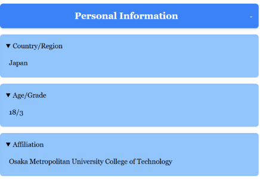
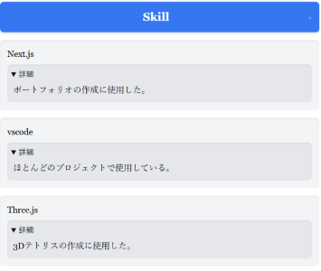
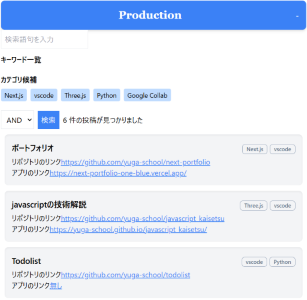

# My Portfolio

## アプリの名前
**Next-Portfolio**  

## 概要
Next-Portfolioは、個人のスキルや制作実績を一元管理・公開するためのWebアプリケーションです。  
- **対象ユーザー:** 就職活動中のエンジニア、フリーランス、自己表現を重視するクリエイターなど  
- **目的:** 自身の成長や実績を整理し、他者にアピールするためのプラットフォームとして設計  
- **特徴:** ノーコードで制作物の投稿やスキルの登録が可能。Next.jsの高速レンダリングとSupabaseのリアルタイムデータベース・認証機能を組み合わせたモダンなWebアプリケーション

### 開発の背景・経緯
このアプリは、最新のWeb技術（Next.js, Supabaseなど）を活用しながら、ユーザーが簡単に自身の制作物やスキルを管理・共有できる仕組みを実現するために開発されました。完全オリジナルの開発として、課題発見能力や解決能力、開発者としてのこだわりを表現するためのプロジェクトでもあります。

### 公開URL
[https://next-portfolio-one-blue.vercel.app/](https://next-portfolio-one-blue.vercel.app/)

---

## 特徴と機能の説明

- **Personal Informationセクション**  
  ユーザーの基本情報（名前、国・地域、年齢、所属など）を分かりやすく表示。  
  
- **Skillセクション**  
  Three.js、VSCode、Python、Google Collabなど、ユーザーのスキルセットを一覧で確認可能。  
  ユーザー自身でスキルの追加・編集ができ、最新の技術トレンドに合わせた自己表現をサポートします。  
  
- **Productionセクション**  
  - JavaScriptの技術解説、Todolist、Merge 2048、2年高専祭、自由課題など、具体的なプロジェクト実績を掲載。  
  - 各プロジェクトには、ソースコードへのリンクやデモサイトへのリンクを付与し、技術的な実力と幅広い取り組みをアピール。  
  
- **カテゴリ作成と投稿機能**  
  1. **カテゴリの新規作成:**  
     - カテゴリ作成画面にアクセスし、追加したいカテゴリの名称と説明を入力後、「カテゴリを作成」ボタンを押すと新規登録されます。  
  2. **制作物の投稿:**  
     - 制作物の新規作成画面で詳細情報（タイトル、本文、カバーイメージなど）を入力し、先ほど作成したカテゴリを選択。  
     - 「制作物を公開」ボタンを押すことで、制作物が自動的に反映され、整理された形でポートフォリオに表示されます。

- **検索機能**  
  メインページのProduction欄に配置された検索機能では、以下の操作が可能です:  
  - **カテゴリ候補からの選択:**  
    カテゴリ候補をクリックすると、キーワード一覧に追加され、検索条件に反映されます。  
  - **キーワード削除:**  
    キーワード一覧右上の「×」ボタンを押すと、対象のカテゴリが除外されます。  
  - **検索方式の選択:**  
    検索ボタン横で、OR検索またはAND検索を選択でき、ユーザーの意図に合わせた柔軟な絞り込みが可能。  
  - **類似度評価:**  
    ユーザー入力と各カテゴリ名の編集距離（挿入・削除・置換の最小操作回数）を元に、類似度が高いカテゴリを上位に表示します。  
    
---

## 使用技術 (技術スタック)

- **言語・フレームワーク:**  
  - **TypeScript**  
  - **Next.js**  
  - **Prisma**

- **バックエンド:**  
  - **Supabase:** リアルタイムデータベース、認証機能を提供

- **開発ツール・ウェブサービス:**  
  - **VSCode**  
  - **Vercel**  
  - GitHub

---

## 開発期間・体制

- **開発体制:** 個人開発  
- **開発期間:** 2025年2月 (約20時間)

---

## 工夫した点・苦労した点

- **ノーコードでの投稿機能:**  
  Next.jsとSupabase APIの連携により、ユーザーがプログラミング知識不要で制作物やスキルを登録できる仕組みを実現。

- **リアルタイム反映:**  
  Supabaseのリアルタイムデータベースを活用し、投稿や編集が即座に反映される効率的なデータフローを構築。

- **高度な検索機能:**  
  編集距離に基づいたカテゴリの類似度評価を実装し、ユーザーの検索意図に沿った正確な絞り込み機能を実現するために工夫を凝らしました。

---

## 既知の課題と今後の展望

- **改善・改良したい点:**  
  - ユーザーインターフェースのさらなる改善（レスポンシブデザインの最適化など）  
  - パフォーマンスのさらなる向上  
  - セキュリティ面での強化（認証やデータ保護の更なる充実）

- **機能拡張のロードマップ:**  
  - **AIによるスキル自動推薦機能:** ユーザーの過去の実績やスキルを分析し、適切なスキルの追加を提案  
  - **ソーシャル連携:** SNSと連携し、制作物のシェアやフィードバック機能の強化  
  - **モバイルアプリ開発:** より多くのユーザーに利用してもらうため、モバイル向けアプリ版の開発を検討

---

## 連絡先

- **ポートフォリオURL:** [https://next-portfolio-one-blue.vercel.app/](https://next-portfolio-one-blue.vercel.app/)  
- **GitHub:** [https://github.com/yuga-school](https://github.com/yuga-school)  
- **所属:** 大阪公立大学工業高等専門学校

